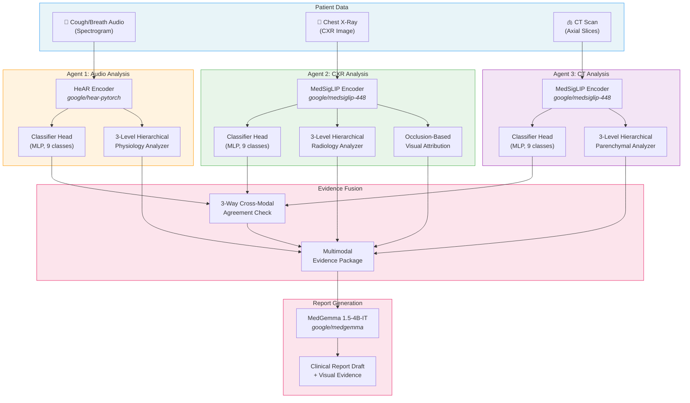

<div align="center">

# 🫁 Multimodal Pulmonary Diagnostic Assistant

**Interpretable, evidence-based clinical decision support using Google HAI-DEF**

[](https://creativecommons.org/licenses/by/4.0/)
[](https://ai.google.dev/gemma/docs/medgemma)
[](https://research.google/blog/hear-health-acoustic-representations/)
[](https://huggingface.co/google/medsiglip-448)

*MedGemma Impact Challenge 2026 — Kaggle Competition Entry*

</div>

---

## 🎯 Problem Statement

Clinical diagnosis of pulmonary diseases remains challenging in resource-limited settings where specialist radiologists and pulmonologists are scarce. Existing AI diagnostic tools often function as opaque "black boxes," providing predictions without interpretable evidence — making it difficult for clinicians to trust, verify, or learn from AI outputs.

**Our solution:** A multimodal pipeline that combines cough/breath audio analysis, chest X-ray (CXR) interpretation, and CT scan analysis to produce **transparent, hierarchical clinical evidence** — not just a label, but a biological story explaining *why* the AI reached its conclusion.

---

## 🏗️ Architecture



---

## 🔬 3-Level Hierarchical Clinical Reasoning

Our key innovation is a **clinician-inspired reasoning framework** that mimics how doctors actually diagnose — progressing from broad categories to specific diseases with quantitative evidence at each level.

### Audio Reasoning Path

| Level | What it does | Example (COVID-19) |
|:---:|---|---|
| **L1** | Broad pathophysiology category | → Cluster A: Infectious/Inflammatory |
| **L2** | Pattern recognition | → Dry cough signature (spectral centroid > 2000 Hz) |
| **L3** | Disease-specific biomarkers | → COVID-19 (score: 0.89) — high-harmonic dry cough, HF energy ratio 0.38 |

### CXR Reasoning Path

| Level | What it does | Example (COVID-19) |
|:---:|---|---|
| **L1** | Broad radiological category | → Cluster A: Increased Opacity |
| **L2** | Distribution & texture | → Peripheral GGO (peripheral ratio 1.52, entropy 0.72) |
| **L3** | Disease-specific patterns | → COVID-19 (score: 0.91) — bilateral symmetric peripheral GGO |

### CT Reasoning Path

| Level | What it does | Example (COVID-19) |
|:---:|---|---|
| **L1** | Broad parenchymal category | → GGO Pattern (96% confidence) |
| **L2** | Distribution & morphology | → Bilateral subpleural (peripheral dist. 78%) |
| **L3** | Disease-specific CT findings | → COVID-19 (score: 0.94) — GGO 64%, crazy-paving 41% |

### Supported Diseases (9 classes)

| # | Disease | Audio Biomarker | CXR Pattern | CT Pattern |
|---|---|---|---|---|
| 1 | COVID-19 | High-harmonic dry cough (>2000 Hz) | Bilateral peripheral GGO | Subpleural GGO + crazy-paving |
| 2 | Lung Cancer | Monophonic wheeze (narrow BW) | Focal unilateral mass | Spiculated nodule/mass |
| 3 | Consolidation | Dense low-centroid sounds | Homogeneous lobar opacity | Air bronchograms in dense opacity |
| 4 | Atelectasis | Diminished + late crackles | Volume loss + shift | Collapsed lobe + mediastinal shift |
| 5 | Tuberculosis | Chronic bouts (burstiness >0.7) | Apical predominant opacity | Cavitary lesions + tree-in-bud |
| 6 | Pneumothorax | "Silent chest" (HF <0.05) | Unilateral hyperlucency | Visceral pleural line + air |
| 7 | Edema | Fine "Velcro" crackles | Central bat-wing pattern | Interlobular septal thickening |
| 8 | Pneumonia | Wet cough, low-freq resonance | Lobar consolidation | Air bronchograms + consolidation |
| 9 | Normal | Normal breath sounds | Clear lung fields | Normal parenchyma |

---

## 📊 Sample Output

<details>
<summary><b>🔍 Click to expand: COVID-19 case — full pipeline output</b></summary>

**Audio Analysis (Level 3):**
```json
{
  "primary_candidate": "1. COVID-19",
  "primary_score": 0.89,
  "evidence_for_primary": [
    "High-harmonic dry cough: spectral centroid 2340 Hz (>2000 Hz threshold)",
    "Energy concentrated in higher frequencies (HF energy ratio: 0.38)",
    "Short explosive bursts without productive phase"
  ],
  "evidence_against_alternative": [
    "No low-frequency mucus resonance — rules out bacterial pneumonia",
    "Spectral centroid too high for productive cough (2340 Hz vs <1500 Hz)"
  ]
}
```

**CXR Analysis (Level 3):**
```json
{
  "primary_candidate": "1. COVID-19",
  "primary_score": 0.91,
  "evidence_for_primary": [
    "Peripheral zone predominance (ratio: 1.52 >1.3 threshold)",
    "Ground glass opacity pattern (texture entropy: 0.72 >0.65)",
    "Bilateral involvement with high symmetry (0.91)"
  ]
}
```

**Cross-Modal Agreement:** ✅ Both modalities converge on COVID-19 (combined confidence: 92%)

**MedGemma Report:**
> **Impression:** High probability of COVID-19 pneumonitis. Audio reveals characteristic high-harmonic dry cough (centroid: 2340 Hz). CXR demonstrates bilateral peripheral ground glass opacities.
>
> **Recommended Next Steps:** RT-PCR confirmation, serial imaging, clinical correlation with symptoms.

</details>

<details>
<summary><b>🔍 Click to expand: Pneumothorax case — cross-modal correlation</b></summary>

**Audio Analysis:** "Silent chest" — HF energy ratio 0.03 (near-absent breath sounds)

**CXR Analysis:** Unilateral hyperlucency (opacity: 0.18) with severe asymmetry (0.42)

**Cross-Modal Agreement:** ✅ Audio silence maps directly to CXR hyperlucency — air in pleural space blocks both sound transmission and normal lung aeration.

**MedGemma Report:**
> **Impression:** High probability of pneumothorax.
>
> **URGENT:** If tension pneumothorax suspected, immediate needle decompression indicated.

</details>

> 💡 Full sample outputs are available in [`docs/sample_outputs/`](docs/sample_outputs/). You can regenerate them locally:
> ```bash
> python generate_sample_outputs.py
> ```

---

## 🚀 Quick Start

### Prerequisites
```bash
pip install -r requirements.txt
```

### Option 1: Generate sample outputs (no GPU needed)
```bash
python generate_sample_outputs.py
```

### Option 2: Run full pipeline
```bash
python pipeline.py \
  --config configs/config.yaml \
  --patient-id P0001 \
  --pairs-index data/pairs.csv
```

### Option 3: Direct file paths
```bash
python pipeline.py \
  --config configs/config.yaml \
  --audio /path/to/spectrogram.png \
  --image /path/to/cxr.jpeg
```

---

## 📁 Repository Structure

```
├── Agent1_Audio/               # Audio analysis agent
│   ├── encoders/               #   HeAR audio encoder
│   ├── classifiers/            #   Classification head (MLP)
│   ├── physiology/             #   3-level hierarchical analyzer
│   └── train_audio_head.py     #   Head training script
│
├── Agent2_Image/               # CXR analysis agent
│   ├── encoders/               #   MedSigLIP image encoder
│   ├── classifiers/            #   Classification head (MLP)
│   ├── physiology/             #   3-level hierarchical analyzer
│   ├── utils/                  #   Occlusion-based visual attribution
│   └── train_image_head.py     #   Head training script
│
├── pipeline/                   # Core pipeline orchestration
│   ├── core.py                 #   Fusion, end-to-end flow
│   └── reporting/              #   MedGemma report generation
│
├── docs/                       # Documentation & demo assets
│   ├── sample_report/          #   ✨ Complete clinical report demo
│   ├── sample_outputs/         #   Ideal pipeline output JSONs
│   └── design/                 #   Internal design documents
│
├── tests/                      # Test suite
│   ├── test_audio_analyzer.py  #   Audio hierarchical analysis tests
│   └── test_cxr_analyzer.py    #   CXR hierarchical analysis tests
│
├── configs/config.yaml         # All pipeline settings
├── data/                       # Dataset (Chest Diseases Dataset)
├── pipeline.py                 # CLI entrypoint
├── generate_sample_outputs.py  # Generate demo outputs locally
├── WRITEUP.md                  # Competition technical report
└── LICENSE                     # CC BY 4.0
```

> 📄 **See the complete sample report:** [`docs/sample_report/COVID19_CASE_REPORT.md`](docs/sample_report/COVID19_CASE_REPORT.md) — a full end-to-end diagnostic walk-through from patient input to clinical report.

---

## 🔧 HAI-DEF Models Used

| Model | Role | How We Use It |
|---|---|---|
| **[HeAR](https://research.google/blog/hear-health-acoustic-representations/)** | Audio encoder | Frozen encoder → embeddings for cough/breath spectrograms |
| **[MedSigLIP-448](https://huggingface.co/google/medsiglip-448)** | CXR encoder | Frozen encoder → embeddings for chest X-rays |
| **[MedGemma 1.5-4B-IT](https://ai.google.dev/gemma/docs/medgemma)** | Report generation | Generates clinical report drafts from multimodal evidence |

All three HAI-DEF models work together in an **agentic pipeline**: two specialized analysis agents feed structured evidence into MedGemma for synthesis.

---

## 🌍 Vision & Impact

- **Interpretability first:** Every conclusion is backed by quantitative measurements and explicit thresholds — no black boxes.
- **Edge-deployable:** Built on open-weight models that can run on local hardware without cloud dependencies.
- **Global health equity:** Designed for resource-limited settings where specialist access is limited.
- **Clinician-centered:** Outputs are structured to support, not replace, clinical decision-making.

---

## ⚠️ Clinical Safety Disclaimer

> **This is NOT a diagnostic tool.** All outputs are hypothesis-level evidence only.
> Designed for research and educational purposes. Always interpret results alongside clinical context and standard of care. Not validated for clinical use.

---

## 📚 References

- [Health Acoustic Representations (HeAR)](https://research.google/blog/hear-health-acoustic-representations/) — Google Research
- [MedSigLIP](https://huggingface.co/google/medsiglip-448) — Medical image-language pretraining
- [MedGemma](https://ai.google.dev/gemma/docs/medgemma) — Medical language model
- [HAI-DEF](https://developers.google.com/health-ai-developer-foundations) — Health AI Developer Foundations

---

<div align="center">

**Built for the [MedGemma Impact Challenge 2026](https://www.kaggle.com/competitions/med-gemma-impact-challenge) on Kaggle**

</div>
