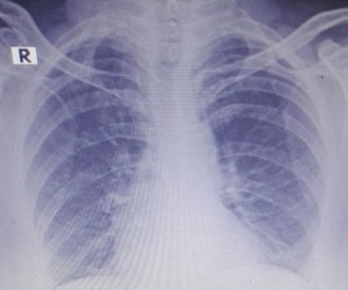
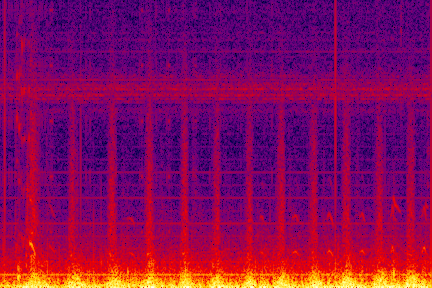
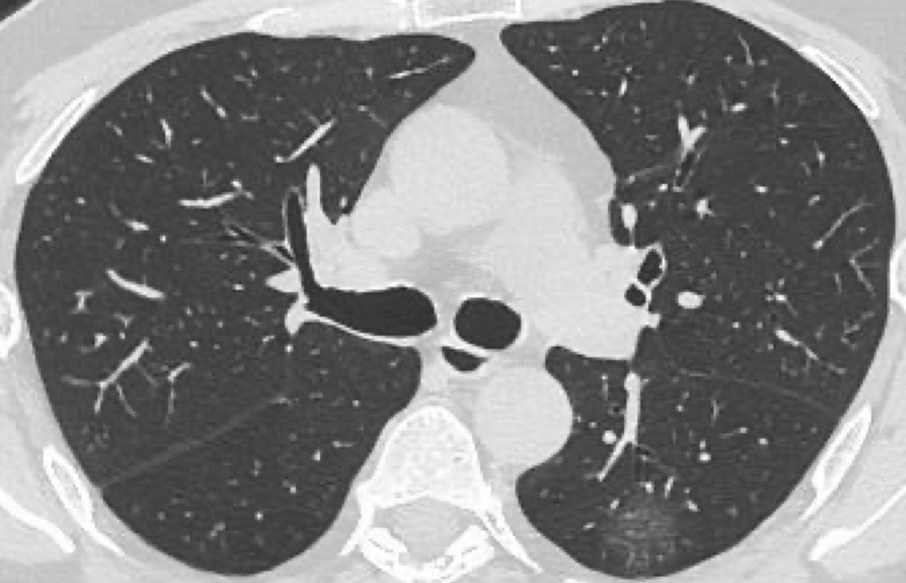
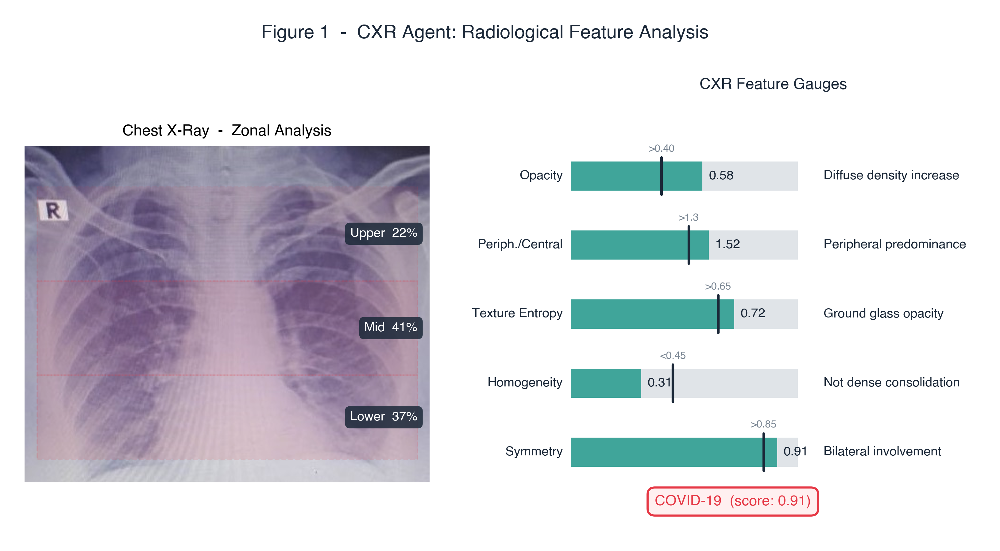
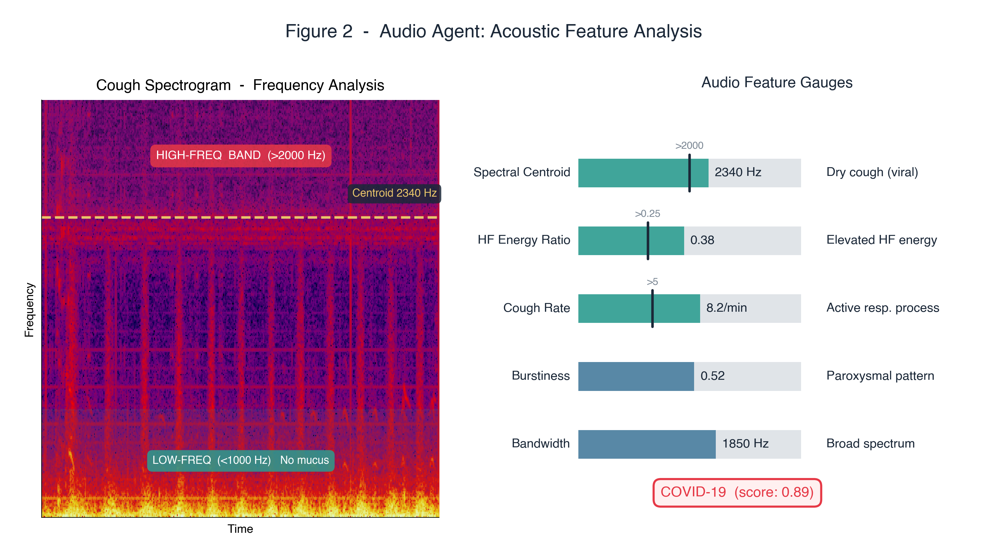
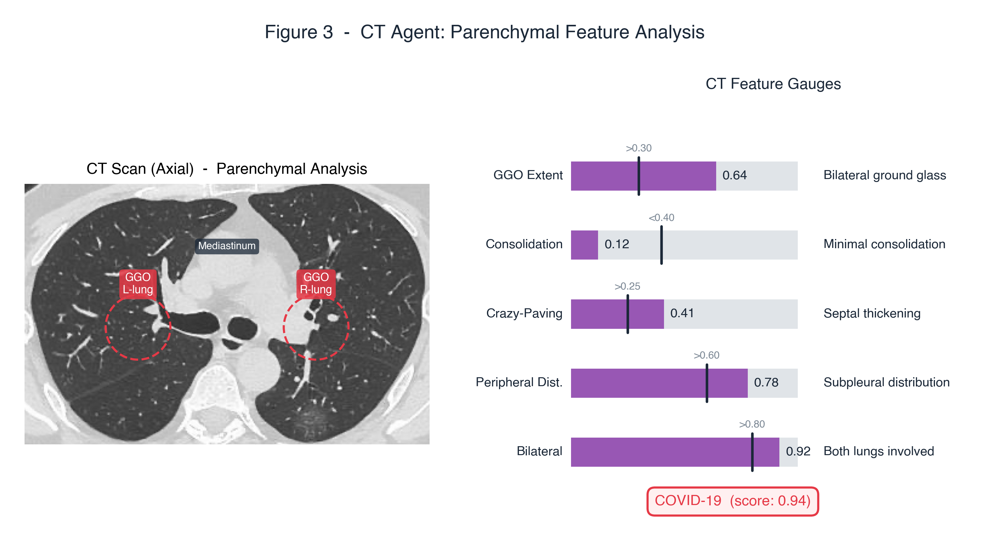
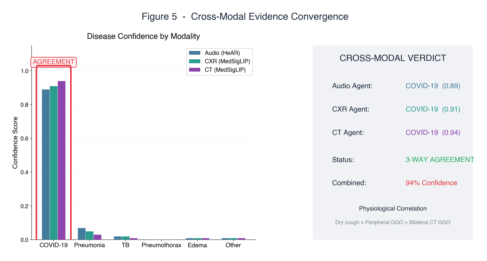
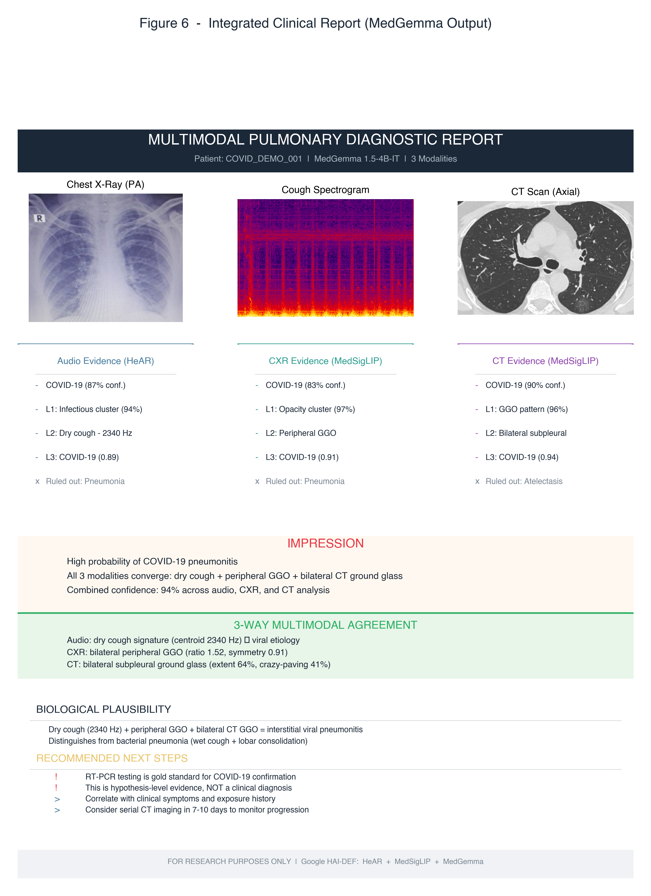
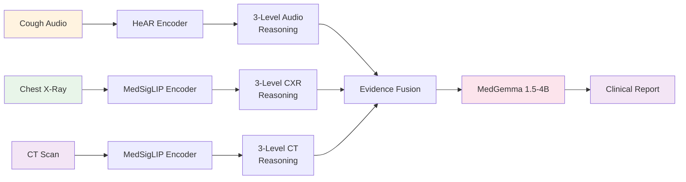

# Clinical Report — Multimodal Pulmonary Diagnostic Assistant

**Patient ID:** `COVID_DEMO_001` &nbsp;|&nbsp; **Date:** 2026-02-22 &nbsp;|&nbsp; **Pipeline v1.0.0**

*This is a demonstration report generated by the Multimodal Pulmonary Diagnostic Assistant.*
*All findings are hypothesis-level evidence — not clinical diagnoses.*

---

## 1. Patient Input Data

| Modality | Input | Encoder |
|:---:|---|---|
| 🎤 **Audio** | Cough/breath recording | HeAR (`google/hear-pytorch`) |
| 🩻 **CXR** | Chest X-ray (PA view) | MedSigLIP (`google/medsiglip-448`) |
| 🫁 **CT** | CT scan (axial slice) | MedSigLIP (`google/medsiglip-448`) |

| CXR (Chest X-Ray) | Spectrogram (Cough Audio) | CT Scan (Axial) |
|:---:|:---:|:---:|
|  |  |  |

---

## 2. CXR Agent — Radiological Feature Analysis

### Why These Features?

The CXR agent analyzes five key radiological features that together characterize patterns of lung disease visible on chest X-ray:

- **Opacity** measures overall lung density increase. Values above 0.40 indicate abnormal density — a hallmark of fluid or inflammatory infiltration in the lung parenchyma.
- **Peripheral/Central ratio** quantifies the spatial distribution of opacities. COVID-19 characteristically presents with *peripheral predominance* (ratio >1.3), unlike pulmonary edema which typically shows central "bat-wing" distribution.
- **Texture Entropy** captures the heterogeneity of lung tissue. Higher entropy (>0.65) corresponds to ground glass opacities (GGOs) — hazy, non-uniform opacities that don't fully obscure underlying structures, a key COVID-19 finding.
- **Homogeneity** distinguishes GGO from dense consolidation. Low homogeneity (<0.45) confirms the opacity is ground glass rather than complete consolidation (which would suggest bacterial pneumonia instead).
- **Symmetry** measures bilateral involvement. COVID-19 is typically bilateral and symmetric (>0.85), helping differentiate it from unilateral conditions like pneumothorax or lobar pneumonia.

*Figure 1. Left: CXR with zonal divisions (Upper 22%, Mid 41%, Lower 37%). Right: All five gauges exceed their respective COVID-19 thresholds (black markers).*

---

## 3. Audio Agent — Acoustic Feature Analysis

### Why These Features?

The audio agent extracts five acoustic biomarkers from the patient's cough spectrogram. These features capture the characteristic sound signatures of different respiratory conditions:

- **Spectral Centroid** is the frequency "center of mass" of the cough. COVID-19 produces a *dry cough* with energy concentrated in higher frequencies (>2000 Hz), as opposed to the low-frequency, productive cough seen in bacterial pneumonia.
- **HF Energy Ratio** quantifies how much of the cough's energy is in the high-frequency band (>4000 Hz). Elevated ratios (>0.25) indicate airway inflammation without significant mucus, consistent with viral interstitial patterns.
- **Cough Rate** (events per minute) reflects the severity and irritability of the respiratory process. Active infectious processes typically show elevated rates (>5/min).
- **Burstiness** captures the temporal pattern — whether coughs come in discrete, explosive bursts (paroxysmal) or are more continuous. COVID-19 tends toward moderate burstiness.
- **Bandwidth** measures the spectral spread of the cough. Broad bandwidth (>1500 Hz) indicates involvement of multiple airway regions, consistent with diffuse inflammatory patterns.

*Figure 2. Left: Annotated spectrogram with high-frequency band (>2000 Hz), spectral centroid (2340 Hz), and low-frequency region. Right: All gauges exceed COVID-19 thresholds.*

---

## 4. CT Agent — Parenchymal Feature Analysis

### Why CT?

CT scanning provides significantly higher sensitivity than CXR for detecting early COVID-19 pneumonitis. While CXR can miss up to 30% of ground glass opacities, CT directly visualizes the lung parenchyma and can detect subtle findings that are invisible on plain radiography.

### Why These Features?

- **GGO Extent** measures the percentage of lung volume affected by ground glass opacities. Values above 0.30 indicate significant bilateral ground glass — the most common CT manifestation of COVID-19.
- **Consolidation** quantifies areas of complete opacification. In early COVID-19, consolidation is typically *low* (<0.40), distinguishing it from bacterial pneumonia which often shows dense lobar consolidation.
- **Crazy-Paving** captures a pattern of GGO with superimposed interlobular septal thickening, which resembles irregular paving stones. Values above 0.25 are a recognized COVID-19 CT finding indicating disease progression.
- **Peripheral Distribution** measures the proportion of abnormalities in subpleural (outer) lung regions. COVID-19 characteristically shows >60% peripheral distribution, unlike sarcoidosis or lymphoma which are typically central.
- **Bilateral** quantifies involvement of both lungs. COVID-19 is overwhelmingly bilateral (>80%), helping distinguish it from unilateral processes like focal pneumonia or lung abscess.

*Figure 3. Left: CT scan with bilateral GGO annotations (dashed red circles) and mediastinal landmarks. Right: All five CT-specific gauges exceed COVID-19 thresholds.*

---

## 5. Cross-Modal Evidence Convergence

### Why Cross-Modal Agreement Matters

Each modality captures complementary information about the patient's condition: audio measures airway dynamics, CXR measures gross anatomical density patterns, and CT resolves fine parenchymal detail. When all three independently converge on the same diagnosis, the combined evidence is substantially stronger than any single modality. The red highlight box in the figure below identifies the disease with highest 3-way agreement.

*Figure 4. Left: Per-disease confidence scores for Audio (0.89), CXR (0.91), and CT (0.94) — all three converge on COVID-19 (red highlight). Right: Verdict card with 3-way agreement confirmation.*

---

## 6. Integrated Clinical Report (MedGemma Output)

### Report Summary

MedGemma 1.5-4B-IT synthesizes the full evidence package from all three agents into a structured clinical report. The report includes:

1. **Input images** — the actual CXR, spectrogram, and CT scan used for analysis
2. **Per-agent evidence cards** — each agent's 3-level hierarchical evidence chain (broad category → pattern → disease score) with the primary differential ruled out
3. **Impression** — the synthesized clinical impression combining all three modalities
4. **3-Way Multimodal Agreement** — specific evidence from each modality supporting the convergent diagnosis
5. **Biological Plausibility** — explanation of *why* these findings form a coherent biological picture (dry cough = airway irritation + GGO = interstitial inflammation = viral pneumonitis)
6. **Recommended Next Steps** — including RT-PCR confirmation, clinical correlation, and follow-up imaging

*Figure 5. Complete multimodal report as would be delivered for clinical review.*

---

## 7. Pipeline Architecture

---

*Report generated by the Multimodal Pulmonary Diagnostic Assistant*
*Built with Google HAI-DEF: HeAR · MedSigLIP · MedGemma*

**⚠️ FOR RESEARCH AND EDUCATIONAL PURPOSES ONLY — NOT A DIAGNOSTIC TOOL**

