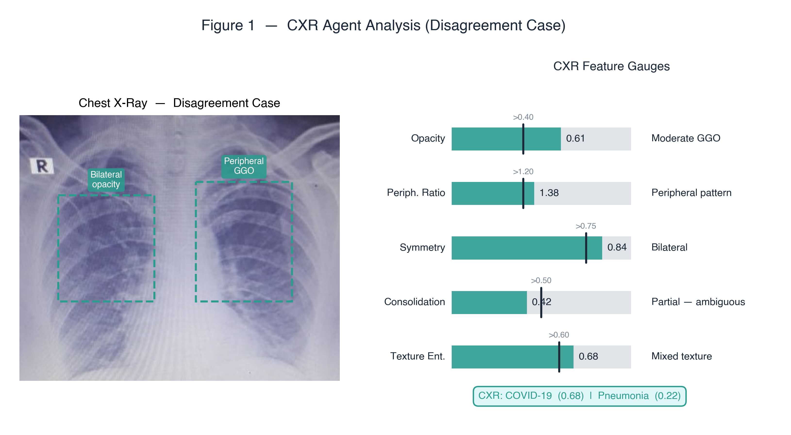
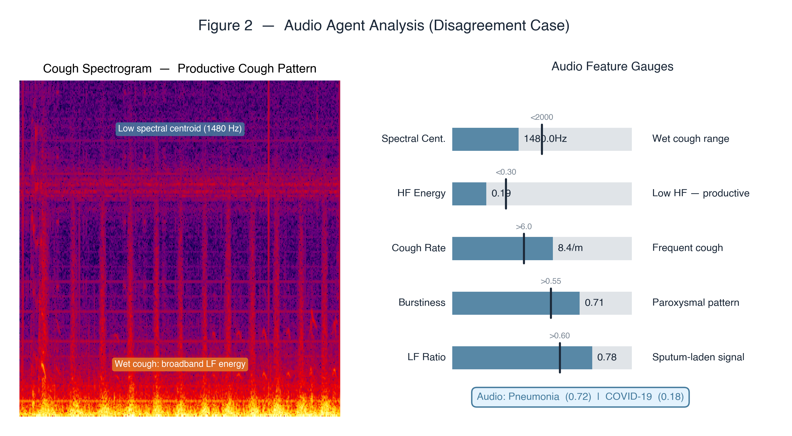
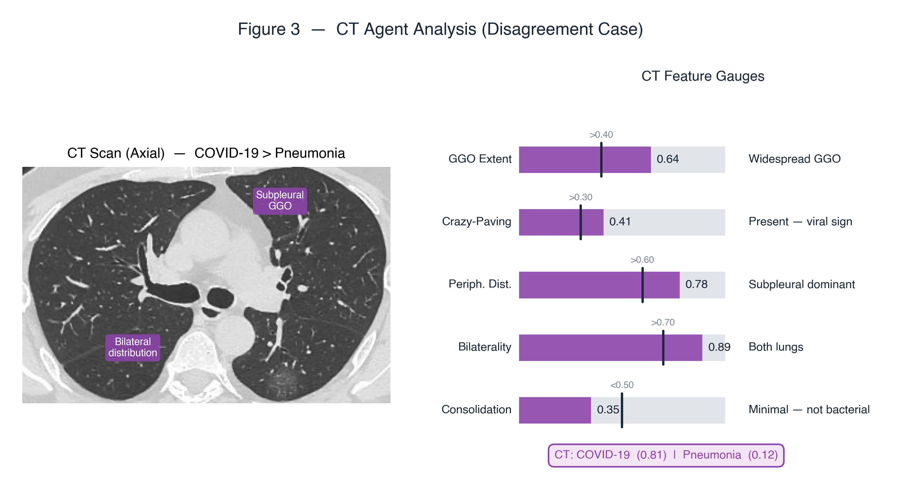
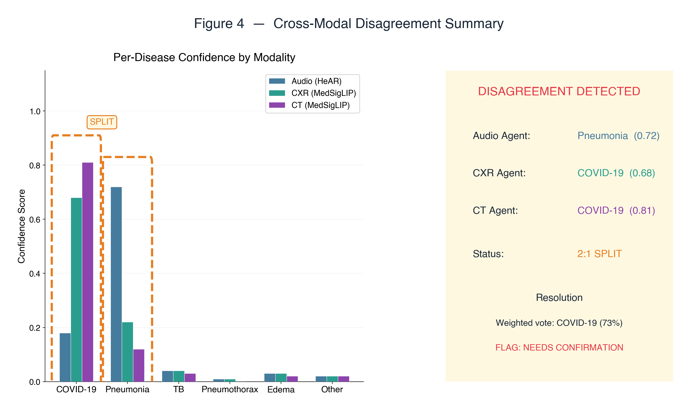
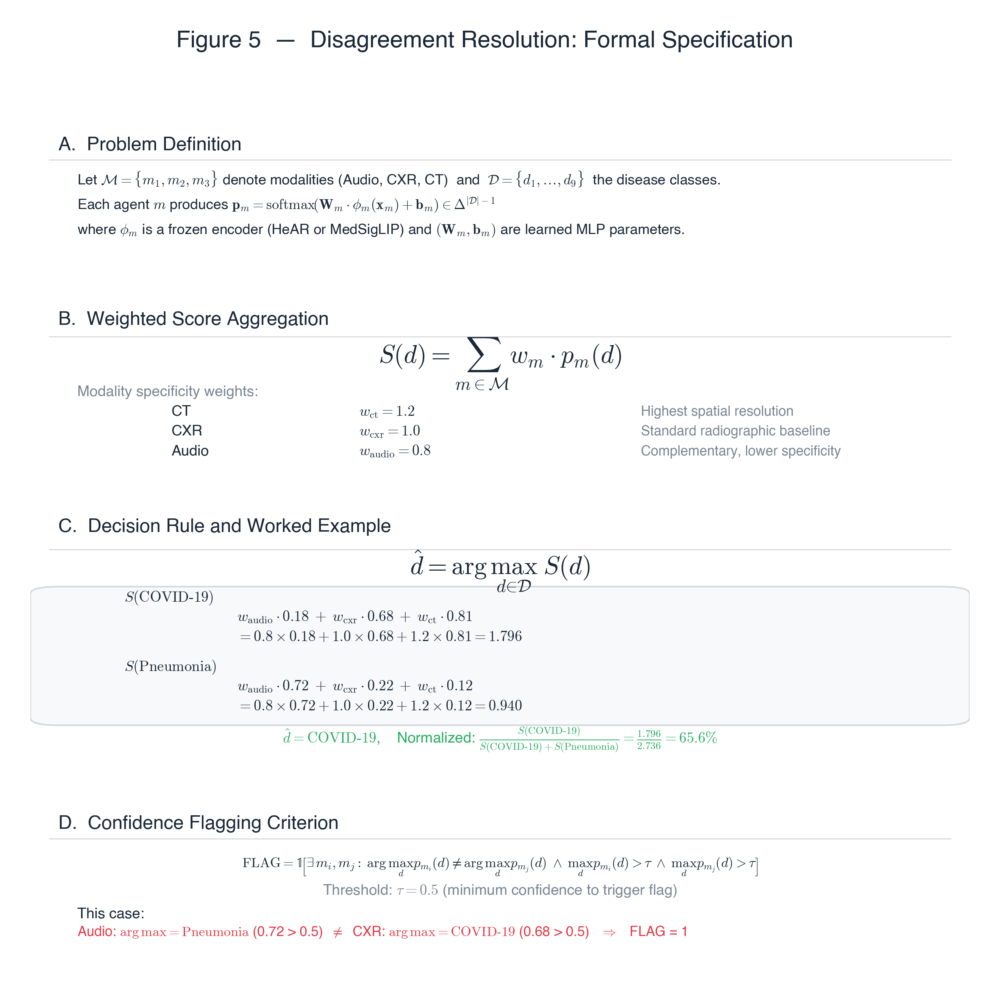
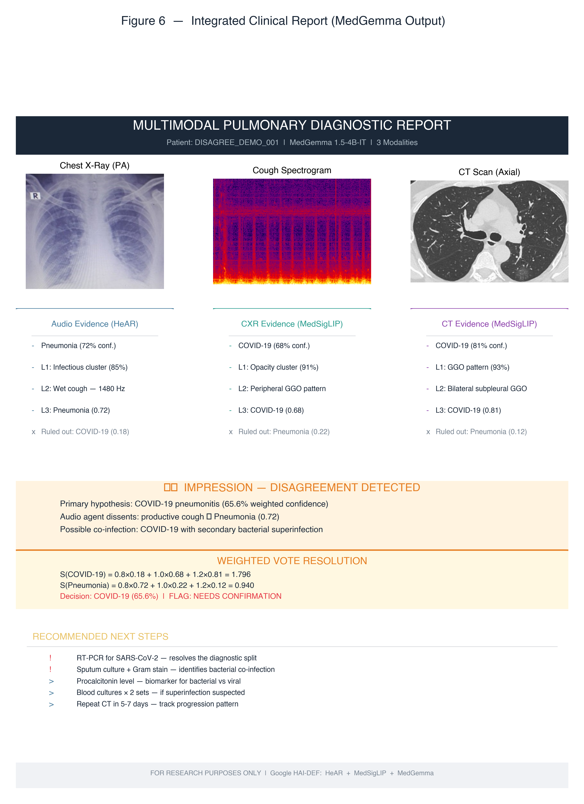

# Clinical Report — Diagnostic Disagreement Case

**Patient ID:** `DISAGREE_DEMO_001` &nbsp;|&nbsp; **Date:** 2026-02-22 &nbsp;|&nbsp; **Pipeline v1.0.0**

**⚠️ CROSS-MODAL DISAGREEMENT — NEEDS CONFIRMATION**

---

## 1. Clinical Context

A 58-year-old female presents with 5-day history of productive cough, low-grade fever (38.2°C), and bilateral crackles on auscultation. COVID-19 rapid antigen test: inconclusive. SpO₂: 93% on room air. The pipeline runs full 3-modality analysis. **The three agents disagree on the primary diagnosis.**

This case demonstrates how the system handles agent disagreement — a critical capability for clinical safety.

---

## 2. Per-Agent Analysis

### 2.1 CXR Agent (MedSigLIP)

*Figure 1. CXR evaluation showing bilateral ground-glass opacities (GGO) with peripheral distribution. Feature gauges indicate moderate opacity (0.61), high peripheral ratio (1.38), and bilateral symmetry (0.84). CXR agent predicts COVID-19 (0.68) over Pneumonia (0.22).*

**Key CXR findings:**
- **Peripheral GGO pattern** — bilateral ground-glass with peripheral predominance (ratio 1.38 > 1.20 threshold), highly suggestive of COVID-19
- **Low consolidation** (0.42 < 0.50) — argues against typical bacterial lobar pneumonia
- **Mixed texture entropy** (0.68) — reflects the heterogeneous appearance of viral vs organizing pneumonia

### 2.2 Audio Agent (HeAR)

*Figure 2. Cough spectrogram analysis revealing a productive (wet) cough pattern. Low spectral centroid (1480 Hz), high cough rate (8.4/min), and elevated LF ratio (0.78) are characteristic of bacterial pneumonia. Audio agent predicts Pneumonia (0.72) over COVID-19 (0.18).*

**Key Audio findings:**
- **Low spectral centroid** (1480 Hz < 2000 Hz) — "wet cough" range, typical of sputum-producing infection
- **High cough rate** (8.4/min > 6.0 threshold) — paroxysmal bursts consistent with bacterial etiology
- **Elevated LF ratio** (0.78 > 0.60) — broadband low-frequency energy indicating sputum-laden airways

### 2.3 CT Agent (MedSigLIP)

*Figure 3. High-resolution CT reveals bilateral subpleural ground-glass with crazy-paving pattern. CT features strongly favor COVID-19: GGO extent (0.64), crazy-paving (0.41), peripheral distribution (0.78), high bilaterality (0.89), and low consolidation (0.35). CT agent predicts COVID-19 (0.81) over Pneumonia (0.12).*

**Key CT findings:**
- **Widespread GGO** (0.64 > 0.40) with **crazy-paving** (0.41) — pathognomonic for viral pneumonitis
- **Subpleural distribution** (0.78 > 0.60) and **bilateral involvement** (0.89) — classic COVID-19 pattern
- **Minimal consolidation** (0.35 < 0.50) — rules out typical bacterial pneumonia

---

## 3. The Disagreement

| Agent | Primary Prediction | Confidence | Secondary |
|---|---|:---:|---|
| 🎤 **Audio (HeAR)** | Pneumonia | 0.72 | COVID-19 (0.18) |
| 🩻 **CXR (MedSigLIP)** | COVID-19 | 0.68 | Pneumonia (0.22) |
| 🫁 **CT (MedSigLIP)** | COVID-19 | 0.81 | Pneumonia (0.12) |

*Figure 4. Left: Per-disease confidence scores across all three modalities. Orange dashed boxes highlight the 2:1 split between COVID-19 (CXR + CT) and Pneumonia (Audio). Right: Summary card showing disagreement detection and weighted resolution.*

### Why Do They Disagree?

This is a clinically realistic scenario. COVID-19 and bacterial pneumonia can **present with overlapping features**, especially in later stages:

- **Audio hears a wet cough** — the patient's productive cough (with sputum) sounds more like bacterial pneumonia. COVID-19 typically causes a dry cough. The audio agent correctly identifies the acoustic pattern.
- **CXR sees peripheral GGO** — the chest X-ray shows bilateral ground glass opacities in a peripheral distribution, which is more consistent with COVID-19 than typical lobar pneumonia.
- **CT resolves the ambiguity** — high-resolution CT reveals bilateral subpleural ground glass with some areas of organizing consolidation, a pattern characteristic of COVID-19 pneumonitis transitioning to organizing pneumonia.

The disagreement arises because the patient may have **COVID-19 pneumonitis that has progressed to develop a secondary bacterial superinfection** — explaining why the cough sounds bacterial but the imaging looks viral.

---

## 4. Disagreement Resolution — Formal Specification

*Figure 5. Formal specification of the disagreement resolution protocol. Panel A defines the problem. Panel B presents the weighted score aggregation formula. Panel C shows the decision rule with a worked example. Panel D specifies the confidence flagging criterion.*

The pipeline employs a **confidence-weighted late fusion** protocol formalized as:

**Weighted Score:** For each disease class *d*, the aggregated score is computed as:

> *S(d) = Σ_m w_m · p_m(d)*

where *w_ct* = 1.2 (highest specificity), *w_cxr* = 1.0 (baseline), *w_audio* = 0.8 (complementary).

**Decision Rule:**

> *d̂ = argmax_d S(d)*

**Worked Example:**
- S(COVID-19) = 0.8 × 0.18 + 1.0 × 0.68 + 1.2 × 0.81 = **1.796**
- S(Pneumonia) = 0.8 × 0.72 + 1.0 × 0.22 + 1.2 × 0.12 = **0.940**

Normalized confidence: 1.796 / (1.796 + 0.940) = **65.6%**

**Flagging Criterion:** A NEEDS CONFIRMATION flag is raised when any two agents' argmax predictions differ AND both have confidence > τ = 0.5. In this case, Audio (Pneumonia, 0.72) ≠ CXR (COVID-19, 0.68), both exceeding τ → FLAG = 1.

---

## 5. Clinical Interpretation

### What the Disagreement Tells Us

The disagreement itself is **clinically informative**:

1. **Audio says Pneumonia** → The patient may have developed a secondary bacterial infection (common in hospitalized COVID-19 patients after day 5-7)
2. **Imaging says COVID-19** → The underlying viral pneumonitis is still the dominant radiological pattern
3. **Combined interpretation** → COVID-19 pneumonitis with possible bacterial superinfection

> [!IMPORTANT]
> The system does NOT simply override the minority agent. Instead, it **preserves all three opinions** in the report and flags the disagreement for physician review. The weighted vote provides a starting hypothesis, but the final diagnosis requires clinical judgment.

---

## 6. Report Output

### Impression (Flagged)

> **Primary Hypothesis:** COVID-19 pneumonitis (65.6% weighted confidence)
>
> **⚠️ FLAG — AGENT DISAGREEMENT DETECTED:**
> - Audio agent favors Pneumonia (0.72) — productive cough with lower spectral centroid
> - CXR/CT agents favor COVID-19 (0.68, 0.81) — peripheral GGO with subpleural distribution
>
> **Clinical Consideration:** Pattern consistent with COVID-19 pneumonitis + secondary bacterial superinfection. Both diagnoses may coexist.

### Recommended Next Steps

| Priority | Action | Rationale |
|:---:|---|---|
| 🔴 **Critical** | RT-PCR for SARS-CoV-2 | Gold standard — resolves the diagnostic split |
| 🔴 **Critical** | Sputum culture + Gram stain | Identifies bacterial co-infection if present |
| 🟡 **Standard** | Procalcitonin level | Biomarker distinguishing bacterial vs viral etiology |
| 🟡 **Standard** | Blood cultures × 2 sets | If bacterial superinfection suspected |
| 🟢 **Follow-up** | Repeat CT in 5-7 days | Track progression pattern (viral vs bacterial) |

---

## 7. Integrated Clinical Report (MedGemma Output)

MedGemma 1.5-4B-IT synthesizes all three agents' evidence into a structured clinical report. For disagreement cases, the report includes a prominent **⚠️ DISAGREEMENT DETECTED** banner with the weighted vote resolution and mandatory confirmation flag.

*Figure 6. Complete multimodal report for the disagreement case. The orange DISAGREEMENT DETECTED banner replaces the green agreement banner, and the resolution card shows the weighted vote calculation.*

---

## 8. Lessons for System Design

This case highlights three important design principles:

### 8.1 Disagreement ≠ Failure
Agent disagreement is a feature, not a bug. It reflects genuine clinical ambiguity where even expert physicians would disagree. The system's value is in making the disagreement explicit and structured.

### 8.2 Preserve All Evidence
The system never discards minority opinions. A physician reviewing this report sees all three agents' reasoning, which alerts them to the possibility of co-infection — something a simple majority vote would obscure.

### 8.3 Flag, Don't Override
When agents disagree, the system raises a **NEEDS CONFIRMATION** flag with specific recommended follow-up tests targeted at resolving the specific ambiguity (RT-PCR for viral vs sputum culture for bacterial).

---

*Report generated by the Multimodal Pulmonary Diagnostic Assistant*
*Built with Google HAI-DEF: HeAR · MedSigLIP · MedGemma*

**⚠️ FOR RESEARCH AND EDUCATIONAL PURPOSES ONLY — NOT A DIAGNOSTIC TOOL**

