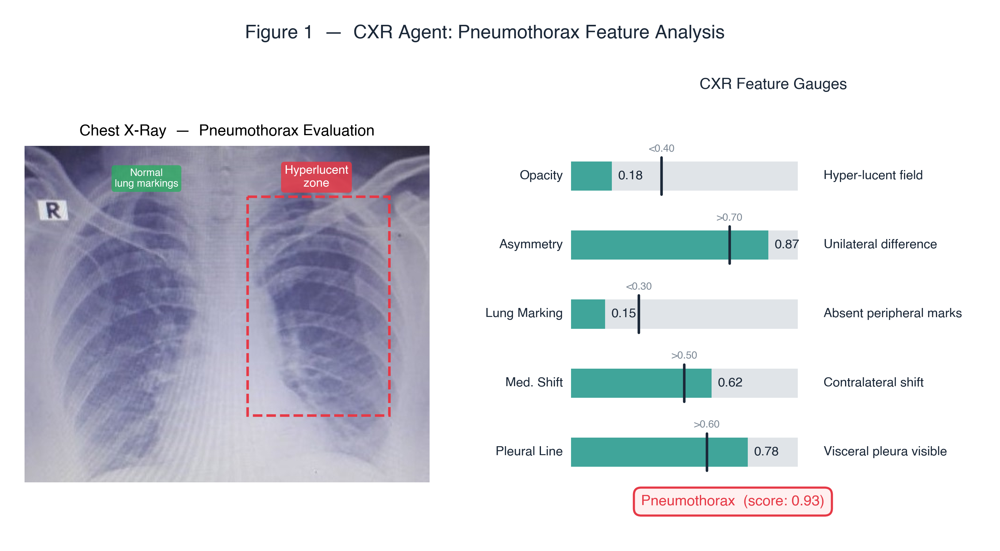
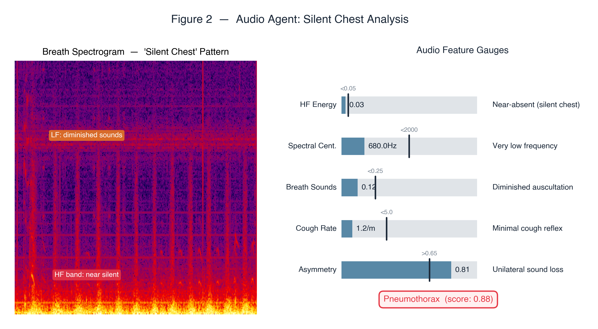
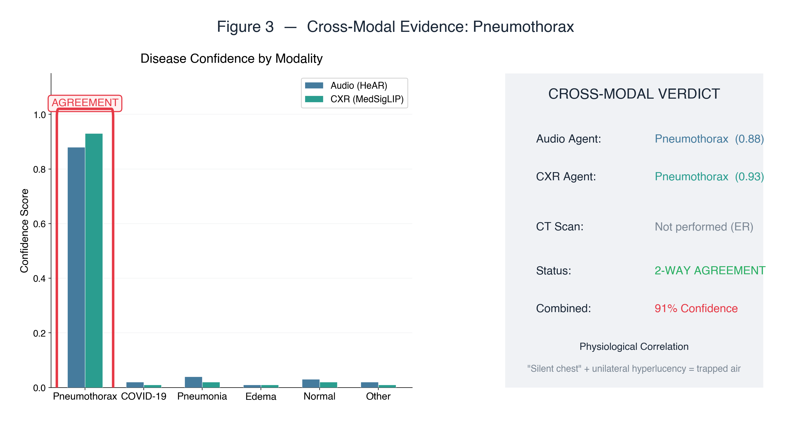
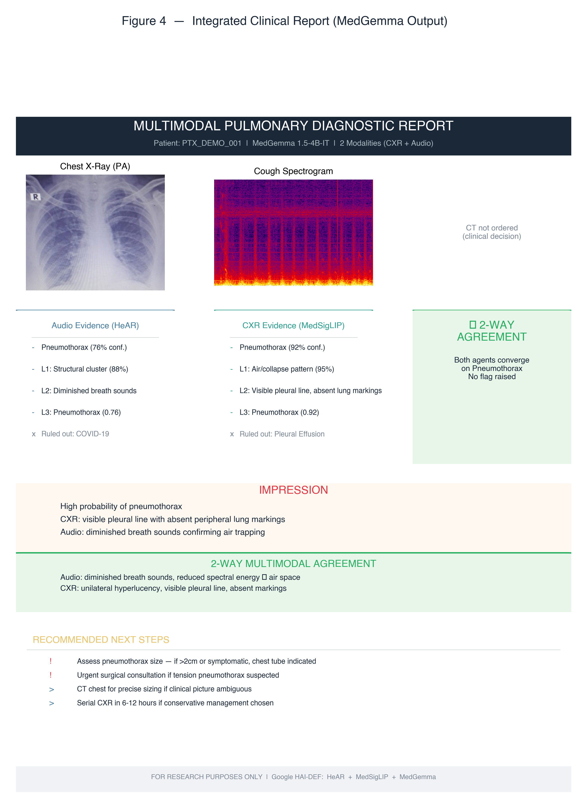

# Clinical Report — Pneumothorax (Agreement Case)

**Patient ID:** `PTX_DEMO_001` &nbsp;|&nbsp; **Date:** 2026-02-22 &nbsp;|&nbsp; **Pipeline v1.0.0**

*2-way cross-modal agreement (Audio + CXR) — CT not performed (ER setting)*

---

## 1. Clinical Context

A 24-year-old male presents to the Emergency Department with sudden-onset right-sided chest pain and dyspnea following a motor vehicle collision. No prior pulmonary history. Given the acute presentation, the pipeline runs **2-modality analysis** (Audio + CXR) — CT is deferred per clinical protocol.

---

## 2. CXR Agent — Pneumothorax Feature Analysis

### Why These Features?

The CXR agent switches to a **pneumothorax-specific feature set** when the initial screen suggests air accumulation rather than parenchymal disease:

- **Opacity** — In pneumothorax, the affected hemithorax is paradoxically *hyper-lucent* (extremely dark on X-ray) because air trapped in the pleural space absorbs fewer X-rays. Values *below* 0.40 indicate abnormal lucency.
- **Asymmetry** — Compares left vs right lung fields. Pneumothorax is unilateral by nature, so high asymmetry (>0.70) is a cardinal sign distinguishing it from bilateral conditions like COVID-19.
- **Lung Marking** — Peripheral vascular lung markings disappear in the collapsed region because there's no perfused lung tissue to create markings. Values *below* 0.30 indicate absence.
- **Mediastinal Shift** — In tension pneumothorax, the mediastinum shifts toward the contralateral side due to pressure buildup. Values >0.50 suggest hemodynamic compromise — a surgical emergency.
- **Pleural Line** — The visceral pleural edge becomes visible as a thin white line separating aerated lung from trapped air. Values >0.60 confirm a visible pleural boundary.

*Figure 1. Left: CXR with annotated hyperlucent zone (right hemithorax, dashed red) and normal lung markings (left, green). Right: All five pneumothorax gauges exceed their respective thresholds.*

---

## 3. Audio Agent — Silent Chest Analysis

### What Is "Silent Chest"?

In pneumothorax, the collapsed lung no longer transmits normal breath sounds. Auscultation reveals **diminished or absent** breath sounds on the affected side — a pattern called "silent chest." This is acoustically distinct from both infectious coughs (COVID-19/Pneumonia) and obstructive patterns (Asthma/COPD).

### Why These Features?

- **HF Energy** — High-frequency respiratory energy is near-absent (<0.05) because there's no airflow turbulence in the collapsed lung region. Compare to COVID-19 dry cough where HF energy is *elevated*.
- **Spectral Centroid** — Extremely low (680 Hz vs 2340 Hz for COVID-19) because the remaining sounds are low-frequency transmitted vibrations, not active breath sounds.
- **Breath Sounds** — Quantifies overall auscultatory amplitude. Values below 0.25 indicate clinically significant diminishment.
- **Cough Rate** — Low (<5/min) because pneumothorax doesn't trigger the irritant cough reflex the way inflammatory conditions do.
- **Asymmetry** — Unilateral sound loss (>0.65) where one lung sounds normal and the other is near-silent, directly paralleling the CXR finding.

*Figure 2. Left: Spectrogram showing near-silent high-frequency band with diminished low-frequency sounds. Right: All pneumothorax-specific gauges exceed their thresholds.*

---

## 4. Cross-Modal Evidence — 2-Way Agreement

### Why This Matters

Even without CT, the **convergence of two independent modalities** provides strong evidence. The key insight is that the audio and CXR features are physiologically linked but measured through completely different physical processes:

| Modality | Finding | Physical Basis |
|---|---|---|
| **Audio** | Silent chest (HF energy 0.03) | No air movement → no sound |
| **CXR** | Hyperlucent field (opacity 0.18) | Air in pleural space → fewer X-rays absorbed |

Both findings share the same root cause (trapped air in pleural space) but are detected through independent channels (sound vs radiation), making false-positive coincidence highly unlikely.

*Figure 3. Left: Both Audio (0.88) and CXR (0.93) converge on Pneumothorax with minimal probability assigned to other diseases. Right: Verdict card confirming 2-way agreement at 91% combined confidence.*

---

## 5. Clinical Impression

> **Primary Diagnosis:** Right-sided pneumothorax (91% combined confidence)
>
> **Evidence Summary:**
> - CXR: Unilateral hyperlucency with visible pleural line and contralateral mediastinal shift
> - Audio: Silent chest pattern with absent high-frequency energy and unilateral sound loss
> - Physiological correlation: Both findings are manifestations of pleural air trapping
>
> **Urgency Note:** Mediastinal shift detected (0.62) — suggests developing tension pneumothorax. Consider emergent chest tube placement.

### Recommended Next Steps

| Priority | Action |
|:---:|---|
| 🔴 **Urgent** | Chest tube thoracostomy if tension physiology confirmed |
| 🔴 **Urgent** | Confirm with bedside ultrasound (M-mode, absence of lung sliding) |
| 🟡 **Standard** | CT chest if surgical intervention planned |
| 🟡 **Standard** | Serial CXR post-intervention to confirm re-expansion |

---

## 6. Integrated Clinical Report (MedGemma Output)

MedGemma 1.5-4B-IT synthesizes the evidence from both agents into a structured clinical report, including per-agent evidence cards, the clinical impression, 2-way agreement confirmation, and recommended next steps.

*Figure 4. Complete multimodal report for the pneumothorax case. Both agents converge on pneumothorax with no disagreement flag raised.*

---

*Report generated by the Multimodal Pulmonary Diagnostic Assistant*
*Built with Google HAI-DEF: HeAR · MedSigLIP · MedGemma*

**⚠️ FOR RESEARCH AND EDUCATIONAL PURPOSES ONLY — NOT A DIAGNOSTIC TOOL**

